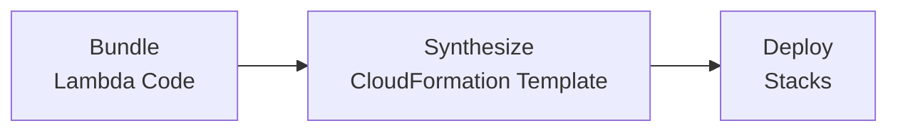

# CDK Deploy

The CDK Deploy command is used to deploy the CDK stack to the AWS account. The command will create a CloudFormation template and deploy the stack to the AWS account.

```mermaid
graph LR
  BUNDLE[Bundle<br/>Lambda Code]
  BUNDLE --> SYNTH[Synthesize<br/>CloudFormation Template] --> DEPLOY[Deploy<br/>Stacks]

```
