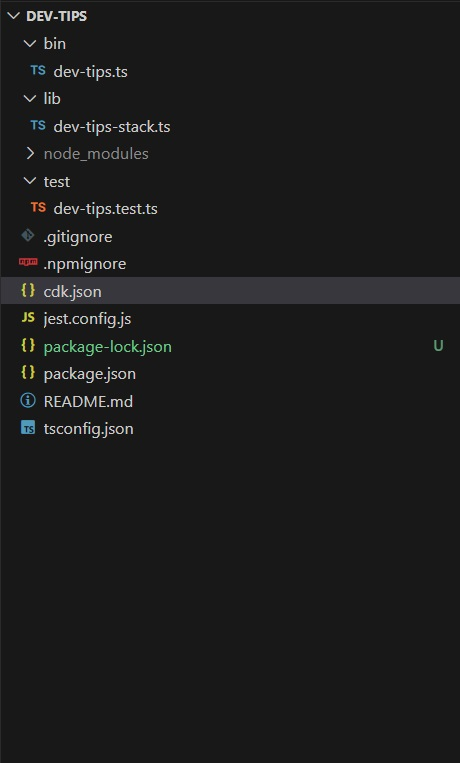
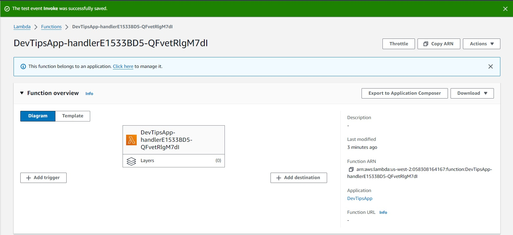
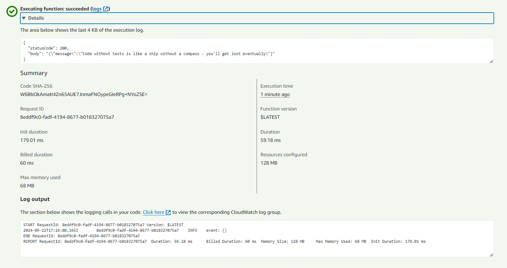
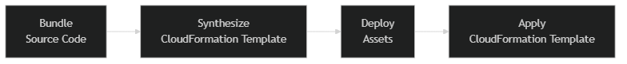
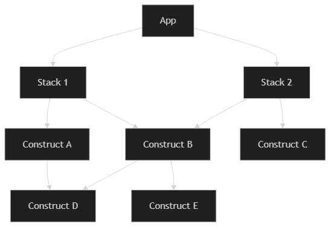

# Getting Started with AWS Cloud Development Kit

Kevin Rich
Senior Software Engineering Manager
Sept 2024

---

# About Me


-   10 years experience with Azure & AWS
-   5 years experience with CDK, released in 2019
-   I enjoy leveraging automation to reduce toil

---

# Overview

-   What is AWS CDK?
-   An Example Project
-   Under the Hood
-   Useful CDK Features
-   When to use CDK (and when not to)
-   Recommendations
-   Wrap Up

---

# What is CDK?

From AWS:

> A software development framework for defining cloud infrastructure-as-code (IaC)

In Reality:

-   A software framework to programmatically build and deploy CloudFormation templates.
-   A mechanism to abstract away some of the complexity of CloudFormation
-   Enables developers to focus on defining the application instead of the infrastructure

---

# What CDK is NOT

-   A silver bullet for all infrastructure needs
-   A replacement for understanding the underlying services

---

## Language support

-   Supports TypeScript, JavaScript, Python, Java, C#, Go (Preview)
-   TypeScript is generally the most feature-rich

---

# An Example Project

---

## Prerequisites

### Local tools

```bash
npm install -g typescript
npm install -g aws-cdk
```

### AWS Account

```bash
cdk bootstrap aws://123456789012/us-west-2
```

---

## Create the project

```bash
mkdir dev-tips
cd dev-tips
cdk init app --language typescript
```

---

## Folder Structure



A few preferences:

-   `bin` -> the entry point
-   `lib` -> infrastructure definitions

---

## Entry Point

```typescript
#!/usr/bin/env node
import * as cdk from 'aws-cdk-lib';
import 'source-map-support/register';
import { DevTipsAppStack } from '../lib/app-stack';

const app = new cdk.App();
new DevTipsAppStack(app, 'DevTipsApp', {});
```

---

## Stack

```typescript
import * as cdk from 'aws-cdk-lib';
import * as nodeLambda from 'aws-cdk-lib/aws-lambda-nodejs';
import { Construct } from 'constructs';

export class DevTipsAppStack extends cdk.Stack {
    constructor(scope: Construct, id: string, props?: cdk.StackProps) {
        super(scope, id, props);

        new nodeLambda.NodejsFunction(this, 'handler', {
            entry: 'lib/app-stack.handler.ts',
            handler: 'handler',
        });
    }
}
```

---

## Stack - Lambda Handler

```typescript
import { Handler } from 'aws-lambda';
import { ProgrammingTipsRepository } from './src/tips-generator-data';

export const handler: Handler = async (event, context) => {
    console.info('event:', event);

    const tips = new ProgrammingTipsRepository();
    const tip = tips.get();

    return {
        statusCode: 200,
        body: JSON.stringify({
            message: tip,
        }),
    };
};
```

---

## Deployment

```text
> cdk deploy
Bundling asset DevTipsApp/handler/Code/Stage...

  cdk.out\bundling-temp-71b27cb79b17c6e62a78ff3861ca3072019b795776390465250ead7ad25bc46d\index.js  10.5kb

Done in 3ms

✨  Synthesis time: 5.32s

DevTipsApp:  start: Building c9b0cc8804636a4a40d61a699ea1cc914bd8fd712db2b783e6d9c983df28f8fa:current_account-current_region
DevTipsApp:  success: Built c9b0cc8804636a4a40d61a699ea1cc914bd8fd712db2b783e6d9c983df28f8fa:current_account-current_region
DevTipsApp:  start: Building 648b7dba1db3fce97f8c4e5ba9144b15d4d4891b495ee5f6e293205e6be9a2d8:current_account-current_region
DevTipsApp:  success: Built 648b7dba1db3fce97f8c4e5ba9144b15d4d4891b495ee5f6e293205e6be9a2d8:current_account-current_region
DevTipsApp:  start: Publishing c9b0cc8804636a4a40d61a699ea1cc914bd8fd712db2b783e6d9c983df28f8fa:current_account-current_region
DevTipsApp:  start: Publishing 648b7dba1db3fce97f8c4e5ba9144b15d4d4891b495ee5f6e293205e6be9a2d8:current_account-current_region
DevTipsApp:  success: Published 648b7dba1db3fce97f8c4e5ba9144b15d4d4891b495ee5f6e293205e6be9a2d8:current_account-current_region
DevTipsApp:  success: Published c9b0cc8804636a4a40d61a699ea1cc914bd8fd712db2b783e6d9c983df28f8fa:current_account-current_region
DevTipsApp: deploying... [1/1]
DevTipsApp: creating CloudFormation changeset...
DevTipsApp | 0/4 | 10:23:00 AM | REVIEW_IN_PROGRESS   | AWS::CloudFormation::Stack | DevTipsApp User Initiated
DevTipsApp | 0/4 | 10:23:06 AM | CREATE_IN_PROGRESS   | AWS::CloudFormation::Stack | DevTipsApp User Initiated
DevTipsApp | 0/4 | 10:23:08 AM | CREATE_IN_PROGRESS   | AWS::IAM::Role        | handler/ServiceRole (handlerServiceRole187D5A5A)
DevTipsApp | 0/4 | 10:23:08 AM | CREATE_IN_PROGRESS   | AWS::CDK::Metadata    | CDKMetadata/Default (CDKMetadata)
DevTipsApp | 0/4 | 10:23:09 AM | CREATE_IN_PROGRESS   | AWS::IAM::Role        | handler/ServiceRole (handlerServiceRole187D5A5A) Resource creation Initiated
DevTipsApp | 0/4 | 10:23:09 AM | CREATE_IN_PROGRESS   | AWS::CDK::Metadata    | CDKMetadata/Default (CDKMetadata) Resource creation Initiated
DevTipsApp | 1/4 | 10:23:09 AM | CREATE_COMPLETE      | AWS::CDK::Metadata    | CDKMetadata/Default (CDKMetadata)
DevTipsApp | 2/4 | 10:23:25 AM | CREATE_COMPLETE      | AWS::IAM::Role        | handler/ServiceRole (handlerServiceRole187D5A5A)
DevTipsApp | 2/4 | 10:23:26 AM | CREATE_IN_PROGRESS   | AWS::Lambda::Function | handler (handlerE1533BD5)
DevTipsApp | 2/4 | 10:23:27 AM | CREATE_IN_PROGRESS   | AWS::Lambda::Function | handler (handlerE1533BD5) Resource creation Initiated
DevTipsApp | 2/4 | 10:23:28 AM | CREATE_IN_PROGRESS   | AWS::Lambda::Function | handler (handlerE1533BD5) Eventual consistency check initiated
DevTipsApp | 2/4 | 10:23:28 AM | CREATE_IN_PROGRESS   | AWS::CloudFormation::Stack | DevTipsApp Eventual consistency check initiated
DevTipsApp | 3/4 | 10:23:33 AM | CREATE_COMPLETE      | AWS::Lambda::Function | handler (handlerE1533BD5)
DevTipsApp | 4/4 | 10:23:34 AM | CREATE_COMPLETE      | AWS::CloudFormation::Stack | DevTipsApp

 ✅  DevTipsApp

✨  Deployment time: 37.41s

Stack ARN:
arn:aws:cloudformation:us-west-2:058308164167:stack/DevTipsApp/51097140-7907-11ef-8eab-02fe2446bd3d

✨  Total time: 42.73s

```

---



---



---

## Under the Hood

---

## How Deployments Work

Under the hood, CDK is programmatically creating/deploying CloudFormation templates



---

## Code Bundling

CDK will bundle Node.js code for Lambda functions using esbuild by default

```typescript
new nodeLambda.NodejsFunction(this, 'handler', {
    entry: 'lib/dev-tips-app-stack.handler.ts',
    handler: 'handler',

    // adding optional bundling configuration
    bundling: {
        minify: true,
        sourceMap: true,
        externalModules: ['aws-sdk'],
        nodeModules: ['axios'],
        esbuildArgs: { 'log-limit': '0' },
    },
});
```

---

## CloudFormation Template Synthesis

We can see the generated artifacts in the `cdk.out` folder

```json
{
    "Resources": {
        "handlerServiceRole187D5A5A": {
            "Type": "AWS::IAM::Role",
            "Properties": {
                "AssumeRolePolicyDocument": {
                    "Statement": [
                        {
                            "Action": "sts:AssumeRole",
                            "Effect": "Allow",
                            "Principal": {
                                "Service": "lambda.amazonaws.com"
                            }
                        }
                    ],
                    "Version": "2012-10-17"
                },
                "ManagedPolicyArns": [
                    {
                        "Fn::Join": [
                            "",
                            [
                                "arn:",
                                {
                                    "Ref": "AWS::Partition"
                                },
                                ":iam::aws:policy/service-role/AWSLambdaBasicExecutionRole"
                            ]
                        ]
                    }
                ]
            },
            "Metadata": {
                "aws:cdk:path": "DevTipsApp/handler/ServiceRole/Resource"
            }
        },
        "handlerE1533BD5": {
            "Type": "AWS::Lambda::Function",
            "Properties": {
                "Code": {
                    "S3Bucket": {
                        "Fn::Sub": "cdk-hnb659fds-assets-${AWS::AccountId}-${AWS::Region}"
                    },
                    "S3Key": "c9b0cc8804636a4a40d61a699ea1cc914bd8fd712db2b783e6d9c983df28f8fa.zip"
                },
                "Handler": "index.handler",
                "Role": {
                    "Fn::GetAtt": ["handlerServiceRole187D5A5A", "Arn"]
                },
                "Runtime": "nodejs18.x"
            },
            "DependsOn": ["handlerServiceRole187D5A5A"]
        }
    }
}
```

---

## How Synthesis Works

<style scoped>
    p { text-align: center; }
</style>



---

## Constructs

-   L1: Thin abstraction layer with direct mapping to CloudFormation
-   L2: Abstractions over L1
-   L3: Shareable chunks of infrastructure

---

```typescript
// L1 Construct
new CfnRole(this, 'Role1', {
    assumeRolePolicyDocument: {
        Version: '2012-10-17',
        Statement: [
            {
                Effect: 'Allow',
                Principal: {
                    Service: 'lambda.amazonaws.com',
                },
                Action: 'sts:AssumeRole',
            },
        ],
    },
    description: 'Example role',
    managedPolicyArns: ['arn:aws:iam::aws:policy/service-role/AWSLambdaBasicExecutionRole'],
});

// L2 Construct
new Role(this, 'Role2', {
    description: 'Example role',
    assumedBy: new ServicePrincipal('lambda.amazonaws.com'),
    managedPolicies: [ManagedPolicy.fromAwsManagedPolicyName('AwsLambdaBasicExecutionRole')],
});
```

---

## L2 Abstraction

The [L2 Code](https://github.com/aws/aws-cdk/blob/main/packages/aws-cdk-lib/aws-iam/lib/role.ts) handles the trivia of building the Raw CloudFormation JSON

```typescript
  constructor(scope: Construct, id: string, props: RoleProps) {
    super(scope, id, {
      physicalName: props.roleName,
    });

    if (props.roleName && !Token.isUnresolved(props.roleName) && !/^[\w+=,.@-]{1,64}$/.test(props.roleName)) {
      throw new Error('Invalid roleName. <...abbreviated...>');
    }

    const externalIds = props.externalIds || [];
    if (props.externalId) {
      externalIds.push(props.externalId);
    }

    this.assumeRolePolicy = createAssumeRolePolicy(props.assumedBy, externalIds);
    this.managedPolicies.push(...props.managedPolicies || []);
    this.inlinePolicies = props.inlinePolicies || {};
    this.permissionsBoundary = props.permissionsBoundary;
    const maxSessionDuration = props.maxSessionDuration && props.maxSessionDuration.toSeconds();
    validateMaxSessionDuration(maxSessionDuration);
    const description = (props.description && props.description?.length > 0) ? props.description : undefined;

    if (description && description.length > 1000) {
      throw new Error('Role description must be no longer than 1000 characters.');
    }
```

---

## Likewise, we can abstract L2 Constructs with an L3 Construct

---

```typescript
// example call from the App
new SampleProcessorStack(app, 'SampleProcessor', { timeout: 60 });

// L3 Construct
export interface SampleProcessorStack extends cdk.StackProps {
    readonly timeout: number;
}

export class SampleProcessorStack extends cdk.Stack {
    constructor(scope: Construct, id: string, props: ExampleL3ConstructProps) {
        super(scope, id, props);

        const queue = new sqs.Queue(this, 'InputQueue', {
            visibilityTimeout: cdk.Duration.seconds(props.timeout),
        });

        const lambdaFn = new lambda.Function(this, 'MyFunction', {
            code: lambda.Code.fromInline(
                'exports.handler = function(event) { console.info(event) }'
            ),
            runtime: lambda.Runtime.NODEJS_20_X,
            handler: 'index.handler',
            timeout: cdk.Duration.seconds(props.timeout),
            events: [new lambdaEventSource.SqsEventSource(queue)],
        });

        const topic = new sns.Topic(this, 'OutputTopic', {});
        topic.grantPublish(lambdaFn);
    }
}
```

---

## Construct Takeaways

-   Constructs are just object-oriented abstractions over CloudFormation
-   Constructs benefit from object-oriented principles like inheritance and composition
-   Constructs offer quality-of-life improvements like the IAM convenience methods

---

# Useful Techniques

---

## Aspects

```typescript
class BucketVersioningChecker implements IAspect {
    public visit(node: IConstruct): void {
        // See that we're dealing with a CfnBucket
        if (node instanceof s3.CfnBucket) {
            // Check for versioning property, exclude the case where the property
            // can be a token (IResolvable).
            if (
                !node.versioningConfiguration ||
                (!Tokenization.isResolvable(node.versioningConfiguration) &&
                    node.versioningConfiguration.status !== 'Enabled')
            ) {
                // Do ONE of the following:
                Annotations.of(node).addError('Bucket versioning is not enabled');
                Annotations.of(node).addWarning('Bucket versioning is not enabled');
                throw new Error('Bucket versioning is not enabled');
            }
        }
    }
}

// Later, apply to the stack
Aspects.of(stack).add(new BucketVersioningChecker());
```

---

## Aspect Tagging

```typescript
const app = new cdk.App();
Tags.of(app).add('Environment', 'Development');

const controlPlane = new cdk.Stack(app, 'ControlPlane');
Tags.of(controlPlane).add('purpose', 'Access Management');
```

---

## Referencing Resources defined in another Stack

```typescript
export class MonitoringPlane extends cdk.Stack {
    public readonly LogGroup: logs.ILogGroup;

    constructor(scope: Construct, id: string, props?: cdk.StackProps) {
        super(scope, id, props);

        this.LogGroup = new logs.LogGroup(this, 'LogGroup', {
            logGroupName: 'my-log-group',
        });
    }
}
```

---

```typescript
export interface ApplicationPlaneProps extends cdk.StackProps {
    readonly logGroup: logs.ILogGroup;
}

export class ApplicationPlane extends cdk.Stack {
    constructor(scope: Construct, id: string, props: ApplicationPlaneProps) {
        super(scope, id, props);

        new nodeLambda.NodejsFunction(this, 'my-function', {
            logGroup: props.logGroup,
        });
    }
}
```

---

```typescript
const app = new cdk.App();
const monitoringPlane = new MonitoringPlane(app, 'MonitoringPlane');
new ApplicationPlane(app, 'ApplicationPlane', {
    logGroup: monitoringPlane.LogGroup,
});
```

---

## Refrencing Resources defined outside the CDK App

```typescript
const logGroup = logs.LogGroup.fromLogGroupArn(
    this,
    'LogGroup',
    'arn:aws:logs:us-west-2:123456789012:log-group:/aws/lambda/my-function:*'
);

new nodeLambda.NodejsFunction(this, 'my-function', {
    logGroup,
});
```

---

## Context Values

```bash
cdk deploy --context LogGroup=MyLogGroup
```

```typescript
const companyName = this.node.tryGetContext('LogGroup');

const logGroup = companyName
    ? logs.LogGroup.fromLogGroupName(this, 'LogGroup', companyName)
    : new logs.LogGroup(this, 'LogGroup', { logGroupName: 'default-log-group' });

new nodeLambda.NodejsFunction(this, 'my-function', {
    logGroup,
});
```

---

## Testing

```typescript
it('should have a DESTROY removal policy', () => {
    const app = new cdk.App();
    const stack = new RemovalPolicyStack(app, 'MyTestStack');
    const template = Template.fromStack(stack);

    template.hasResource('AWS::DynamoDB::Table', {
        DeletionPolicy: 'Delete',
    });
});
```

---

## Cleaning Up

```bash
cdk destroy
```

Some resources may not be deleted by `cdk destroy` based on resource policy. Typically, data-related resources like S3 buckets, RDS instances, etc. are not deleted by default.

```typescript
// we can set the retention policy explicitly
const table = new dynamodb.Table(this, 'Table', {
    partitionKey: { name: 'id', type: dynamodb.AttributeType.STRING },
    removalPolicy: cdk.RemovalPolicy.DESTROY,
});
```

---

# When to use CDK

When you want to...

-   invest in AWS abstractions over in-code solutions
-   leverage the power of CloudFormation without the complexity
-   use a programming language to define your infrastructure
-   share infrastructure definitions across teams
-   'Lint' your infrastructure definitions

---

# When NOT to use CDK

When you...

-   work in a team heavily invested in other IaC tools (Terraform, Pulumi, etc.)
-   work in a team that is not comfortable with programming
-   are not familiar with the underlying AWS services
-   are not comfortable with the CDK learning curve
-   are not comfortable with the CDK's abstraction

---

# Recommendations

1. Understand the AWS Services before provisioning them
2. Understand the AWS Service billing models before provisioning them
3. If provisioning an account to learn, secure it immediately and set budget alerts.

---

# Questions?

> "The only stupid question is the one not asked"

# Resources

-   CDK Workshop:
    https://cdkworkshop.com
-   AWS CDK Reference Documentation
    https://docs.aws.amazon.com/cdk/api/v2/
-   AWS CDK Developer Guide
    https://docs.aws.amazon.com/cdk/v2/guide
